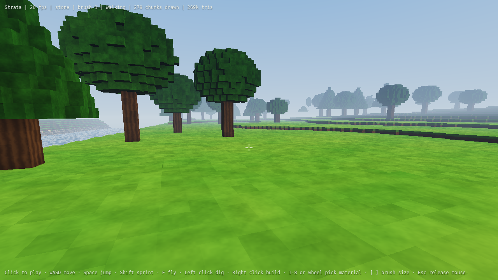
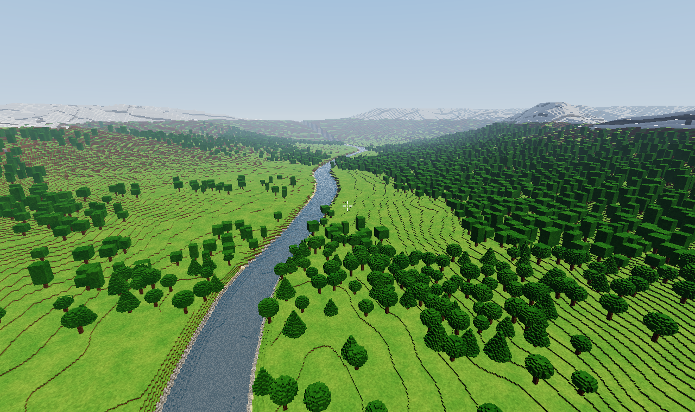

# Strata

A living voxel world on its own engine, for desktop and the browser. Every
surface, colour and shape is generated from code. The game ships no textures,
models or sound files.



This is the first engine slice. It covers the parts every later feature
depends on:

- A 2 × 2 km river valley between ridged mountains, generated from a seed.
  It has caves, beaches, gravel river beds, snow caps and forests of round
  and conifer trees.
- Half-metre voxels, twice as fine as Minecraft's, stored in 32³ chunks that
  collapse to a single value when uniform.
- Chunks stream in and out around the player within a per-frame time budget,
  so loading never stalls a frame.
- The rest of the valley, out to the snow-capped rim 2 km away, is drawn as a
  far field: blocky columns built from the terrain's height function in 64 m
  tiles, with 2, 4 or 8 m cells depending on distance and box-shaped forests.
  The shader hides far tiles wherever the full voxel meshes are drawn.
- Meshing emits only visible faces, with per-corner ambient occlusion.
- A wgpu renderer with a procedural sky, filmic tone mapping, distance fog,
  animated translucent water and textureless procedural materials. It uses
  reverse-Z depth and frustum culling.
- First-person walking with gravity, auto step-up onto half-metre ledges,
  swimming and a fly mode.
- Digging and building with a sphere brush. Holes dug below the river line
  fill with water.

## Running

Desktop (Windows, macOS, Linux):

```sh
cargo run --release
```

Browser (needs a WebGPU browser such as current Chrome, Edge, Safari or Firefox):

```sh
cargo install wasm-bindgen-cli --version 0.2.129   # once; must match Cargo.lock
./scripts/build-web.sh
python3 -m http.server -d web 8080                  # then open http://localhost:8080
```

## Controls

| Input | Action |
| --- | --- |
| Click | Capture the mouse |
| W A S D | Move |
| Space | Jump, swim up, or rise when flying |
| Shift | Sprint (fly faster when flying) |
| C or Ctrl | Descend when flying |
| F | Toggle flying |
| Left mouse | Dig |
| Right mouse | Build with the selected material |
| 1 to 8 or mouse wheel | Pick material |
| `[` and `]` | Shrink or grow the brush |
| Esc | Release the mouse |

## Layout

| File | Purpose |
| --- | --- |
| `src/noise.rs` | Seeded hash and value noise, fractal and ridged variants |
| `src/terrain.rs` | World generation: valley, river, caves, materials, trees |
| `src/chunk.rs` | 32³ voxel chunks with uniform-chunk compression |
| `src/world.rs` | Loaded chunks, streaming, edits and voxel ray casts |
| `src/mesh.rs` | Face-culled meshing with ambient occlusion |
| `src/far.rs` | Far-field tiles and their levels of detail |
| `src/player.rs` | Movement and collision |
| `src/renderer.rs` | wgpu setup, pipelines, per-chunk buffers, culling |
| `src/shaders/world.wgsl` | Sky, procedural materials, water and crosshair |
| `src/game.rs` | Per-frame glue: input, streaming, meshing, edits |
| `src/app.rs` | Window and event loop for both targets |
| `src/web.rs` | Browser entry point |

`cargo run --release --example worldgen_bench` reports how long generating
and meshing the area around spawn takes, and how long the far field takes.



## Next steps

1. Generation and meshing on worker threads. Browsers need cross-origin
   isolation headers for this.
2. Flowing water that pools, floods and can be dammed.
3. A day cycle, weather and seasons.
4. Co-op: a second player joins from a link and sees every edit live.
